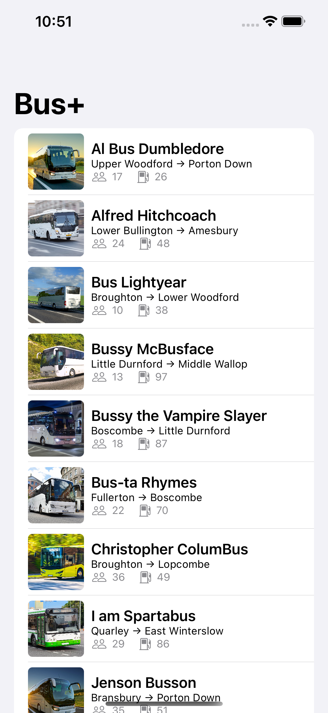

# Bus+

Part of my Xcode projects and sources created during [Hacking With Swift Live](http://hackingwithswift.com/live) online-workshops hosted by [@twostraws](https://github.com/twostraws).

A small app showing some of the new features in **SwiftUI**:

- `AsyncImage` to easily load and show an image based on an URL

- Concurrency using `.task` modifier to initialize data when view appears (and is cancelled when the view disappears).

- *More to come on day 3...*

