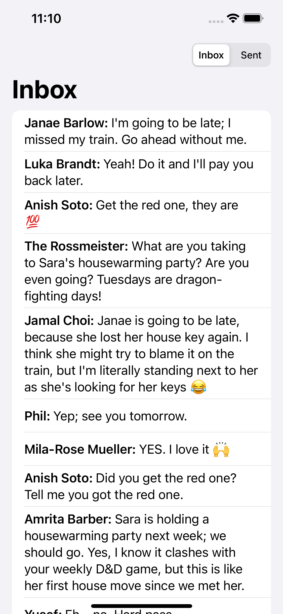

# Message Inbox

Part of my Xcode projects and sources created during [Hacking With Swift Live](http://hackingwithswift.com/live) online-workshops hosted by [@twostraws](https://github.com/twostraws).

Learning about the new basic concurrency features: `async` and `await` keywords, 
  SwiftUI `.task` modifier (as alternative to `.onAppear`),  `async let` assignment and `Task` struct to run/submit parallel tasks.

