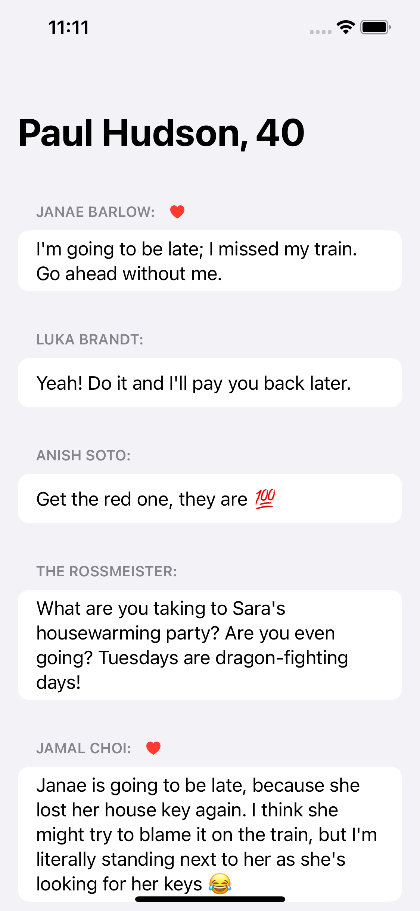

# Practice Chat Messages

Part of my Xcode projects and sources created during [Hacking With Swift Live](http://hackingwithswift.com/live) online-workshops hosted by [@twostraws](https://github.com/twostraws).

Practicing writing an app downloading 3 independent JSON data files and displaying them using SwiftUI.

