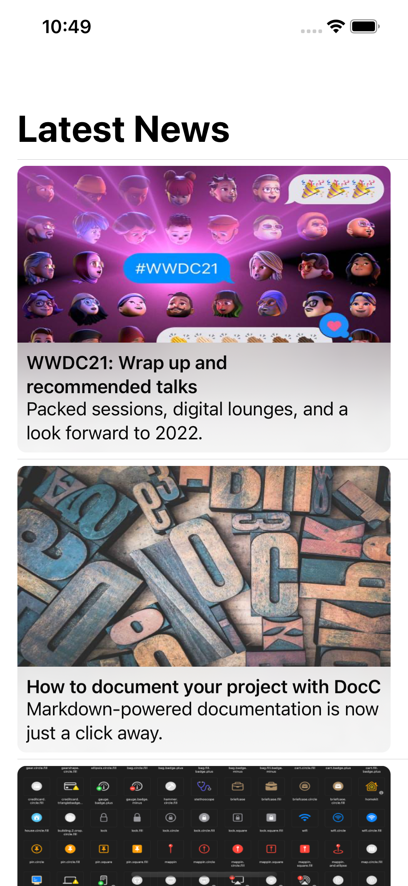

# Practice News Stories

Part of my Xcode projects and sources created during [Hacking With Swift Live](http://hackingwithswift.com/live) online-workshops hosted by [@twostraws](https://github.com/twostraws).

Writing a small app showing news stories fetched from 5 JSON feeds, concatenating and sorting for display.

